# Simulation Report — Network Reconnaissance via Nmap

**Date:** 2026-05-07  
**Attacker Machine:** Kali Linux (192.168.2.10)  
**Victim Machine:** Windows 10 (192.168.1.10)  
**Objective:** Minimally simulating an attacker's initial reconnaissance step via Nmap scans, highlighting the importance of Windows Defender Firewall as a first line of defense, and the need for network traffic analysis capabilities through IDS/IPS solutions rather than relying solely on a SIEM for network-level threat detection.  
**Environment State:** Two phases — Firewall ON (default hardened state) and Firewall OFF (simulating exposed host). Network traffic captured via TCPDump on Ubuntu gateway and analyzed in Wireshark (Host Machine).

---

## 1. Attack Overview

In this simulation, an attacker positioned on a separate network segment performed network reconnaissance against a Windows 10 endpoint using Nmap. All traffic was routed through an Ubuntu gateway acting as a central monitoring point, simulating a real SOC network topology. The simulation was conducted in two phases — first with Windows Defender Firewall enabled, then disabled — to evaluate the impact on both attack surface exposure and detection capability.

---

## 2. Tools Used

| Tool | Purpose |
|------|---------|
| Nmap | Conduct network reconnaissance and port scanning to simulate an attacker's initial discovery phase |
| TCPDump | Capture all network traffic on the Ubuntu gateway during scans |
| Wireshark | Analyze packet captures and extract network-level evidence |
| Wazuh SIEM | Aggregate endpoint logs and evaluate detection capability against reconnaissance activity |
| Sysmon | Installed for endpoint monitoring, however incoming network connections were not captured due to Sysmon's design limitations for this scenario |
| Windows Defender Firewall | Evaluated as a first line of defense — tested in both enabled and disabled states |

---

## 3. Attack Steps (Kali)

### Step 1 — Host Discovery

```bash
nmap -sn 192.168.1.10
```

**Result:** Target did not respond to ICMP ping requests. Windows Defender Firewall blocks ICMP echo requests by default. Host was confirmed alive based on prior network configuration verification.

**Network Analysis:** No packets captured on Ubuntu gateway — Nmap aborted discovery before sending scan traffic.

---

### Step 2 — TCP Connect Scan (Firewall ON)

```bash
nmap -sT -Pn 192.168.1.10
```

**Result:** All 1000 ports returned as ignored state. Scan took ~220 seconds.

**Network Analysis:**
- 12,105 total packets captured — 99.2% pure TCP
- 4,366 packets originated from Kali (192.168.2.10)
- All packets were uniform 80 bytes — automated scanning signature
- Pattern: SYN → TCP Retransmission → no response
- 2,000 conversation streams — every stream one-directional (zero bytes returned from Windows)
- Zero RST packets from Windows — confirmed silent drop behavior
- Nmap performed reverse DNS lookup (3 DNS queries) before scanning

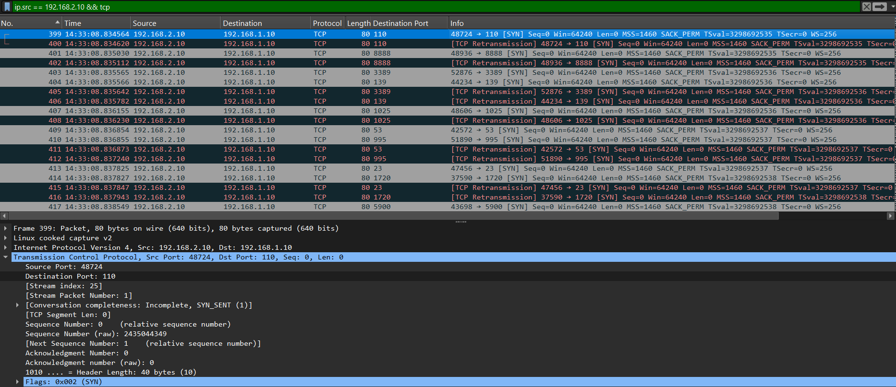
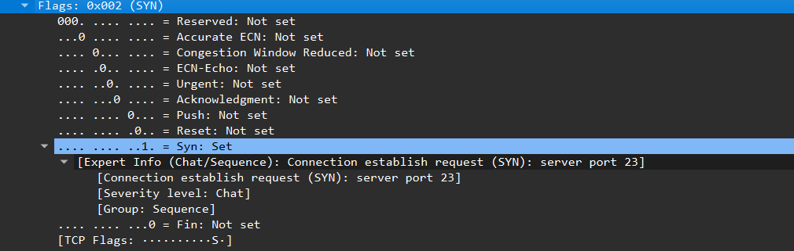
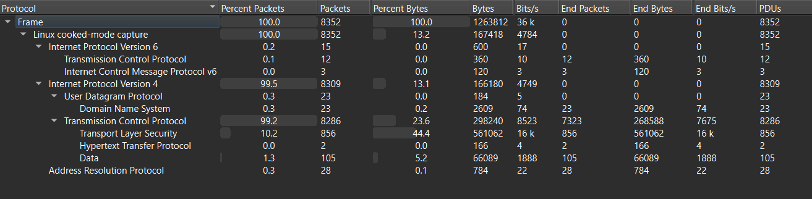
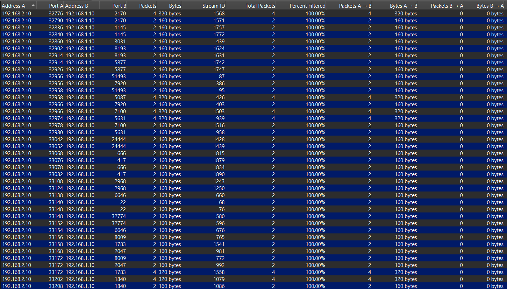

---

### Step 3 — SYN Stealth Scan (Firewall ON)

```bash
nmap -sS -Pn 192.168.1.10
```

**Result:** All 1000 ports ignored. Scan took ~220 seconds.

**Network Analysis:**
- 9,548 total packets captured
- Packets smaller than TCP scan — 66 bytes (SYN) / 64 bytes (retransmission)
- Window size Win=1024 — deliberately small, well-known SYN scan IDS signature
- Stripped TCP options compared to TCP Connect scan
- All 2,000 conversation streams one-directional — zero bytes returned
- Uniform 2 packets per stream (130 bytes) vs TCP scan's variable 2-4 packets

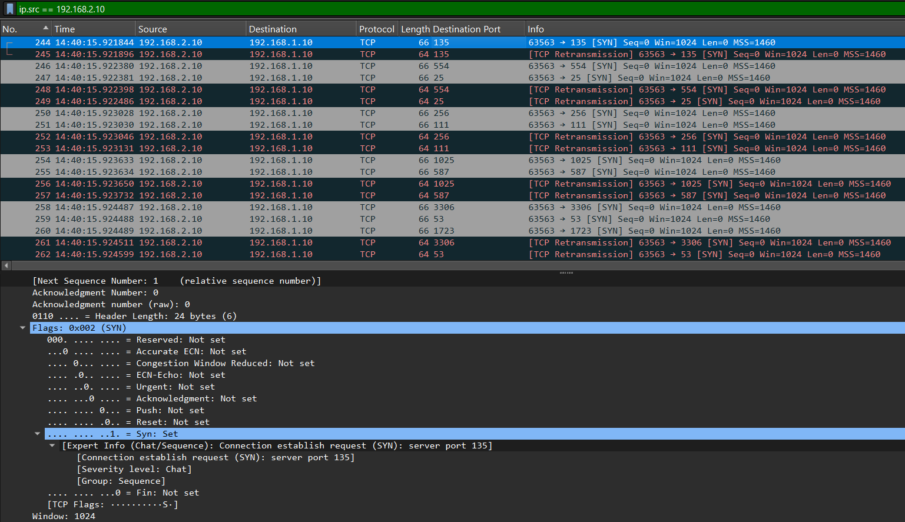
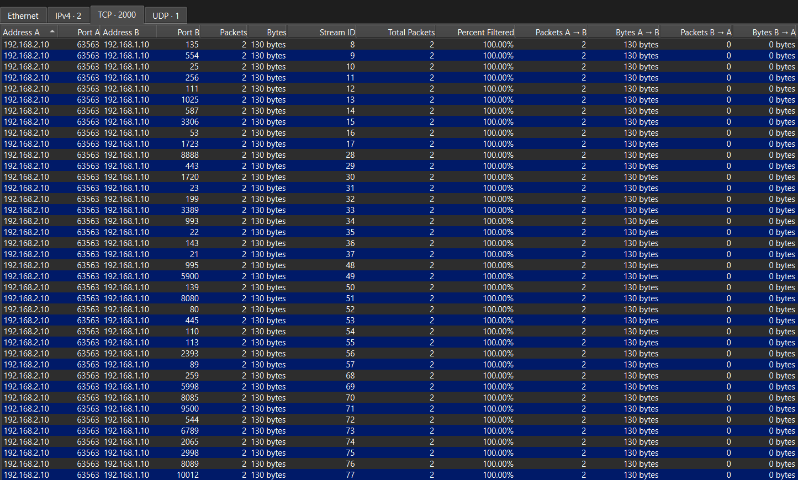

---

### Step 4 — UDP Scan (Firewall ON)

```bash
nmap -sU -Pn 192.168.1.10
```

**Result:** All ports ignored. Scan took ~220 seconds.

**Network Analysis:**
- 7,442 total packets captured
- Unlike TCP scans, Nmap sent protocol-specific UDP payloads — not generic probes
- Protocols observed: RADIUS, RIPv1, SNMP, SIP, NTP, NBNS, Portmap, ISAKMP, Kerberos, L2TP, MDNS, NFS, SSDP
- Only 4 ICMP responses from Windows — all "Parameter Problem" not "Port Unreachable"
- Firewall rejected malformed protocol payloads before port state could be determined
- Complete UDP port state concealment achieved

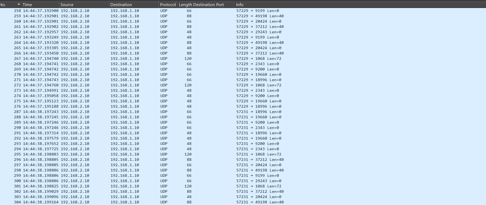
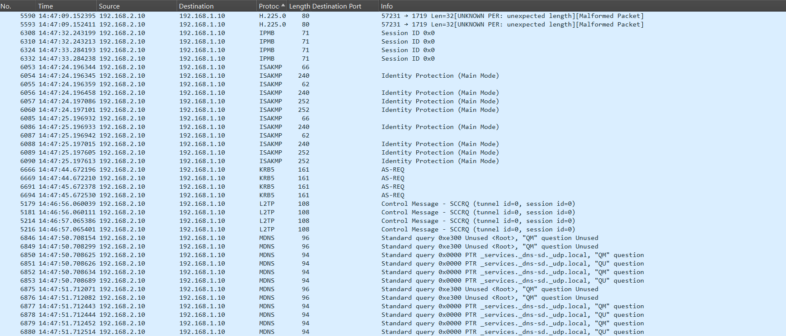
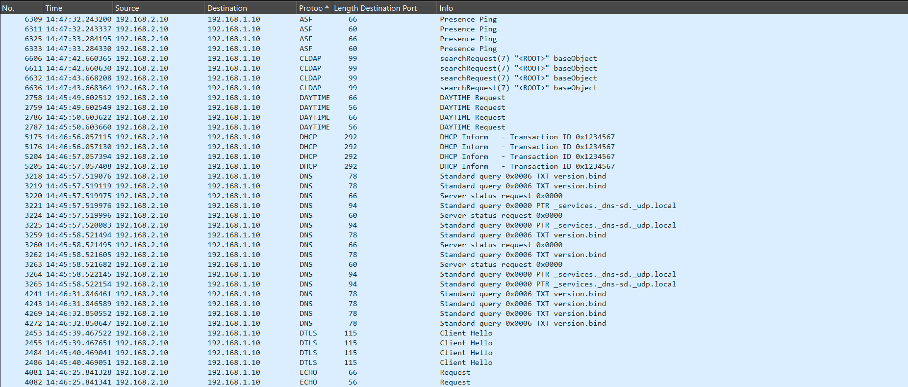
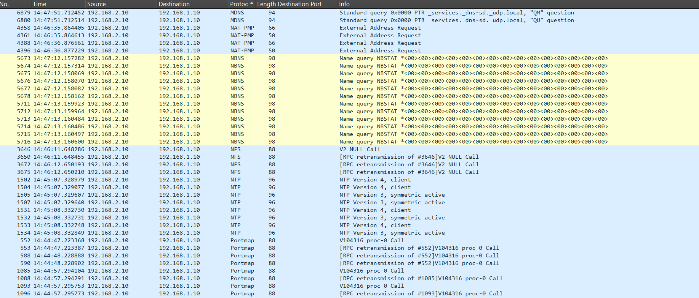
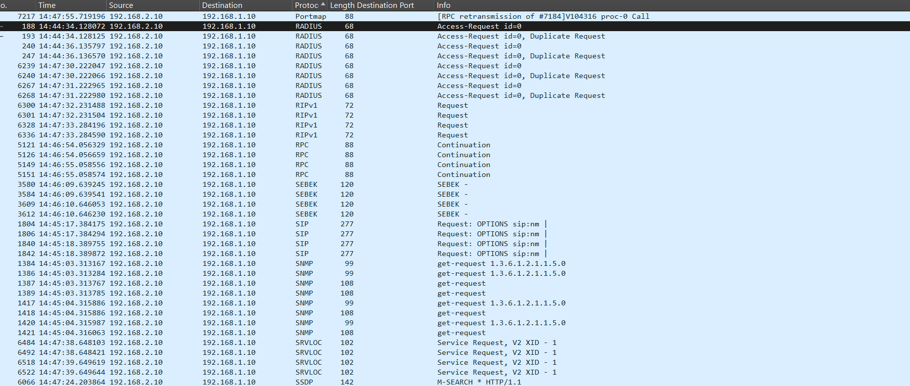
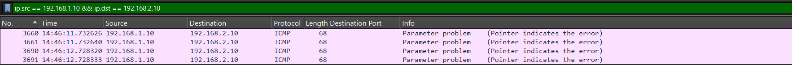

---

### Step 5 — Aggressive Scan (Firewall ON)

```bash
nmap -A -Pn 192.168.1.10
```

**Result:** All ports ignored. 2049 packets sent, 1 received. Scan took ~220 seconds.

**Network Analysis:**
- 8,396 total packets — 228 non-TCP (DNS, ICMP, UDP)
- OS detection probes observed — Christmas tree packets (FIN, PSH, URG flags)
- ICMP probes with varying TTL values — traceroute attempting to map network path
- All probes returned no response — firewall blocking everything
- Additional scan intensity provided zero advantage against active firewall

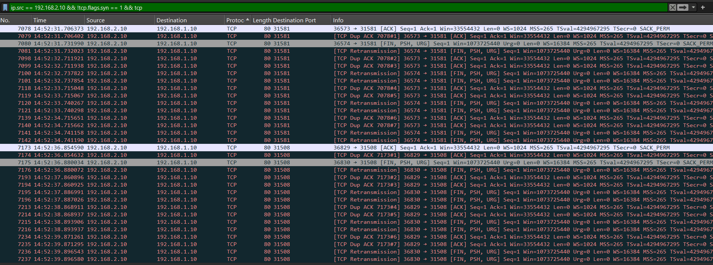
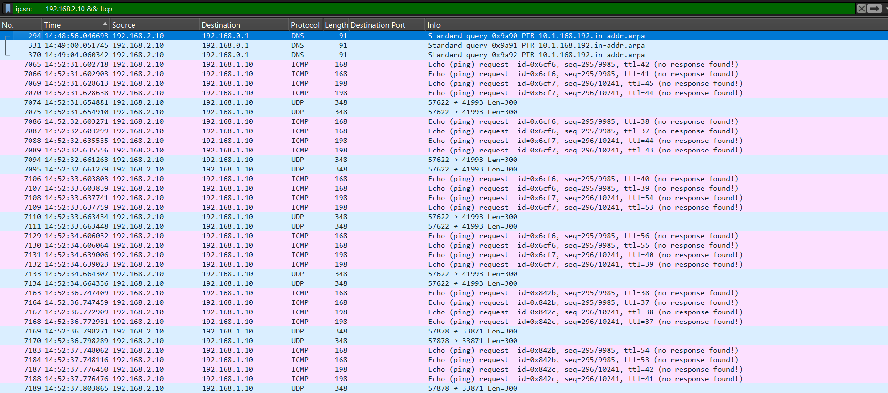

---

### Step 6 — TCP Connect Scan (Firewall OFF)

```bash
nmap -sT -Pn 192.168.1.10
```

**Result:** 997 ports closed, 3 open — **135 (RPC), 139 (NetBIOS), 445 (SMB).** Scan completed in just 13 seconds.

**Network Analysis:**
- 4,481 packets captured — significantly fewer than firewall ON (12,105)
- Scan 17x faster than firewall ON — Windows actively responding instead of silent drop
- Full 3-way handshake observed on open ports: SYN → SYN-ACK → ACK → RST-ACK
- Closed ports received RST responses — confirming active firewall OFF state
- Conversations showed 126 bytes returned per stream vs 0 bytes with firewall ON
- SYN-ACK responses confirmed open ports: 135, 139, 445

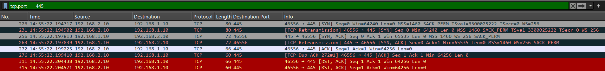
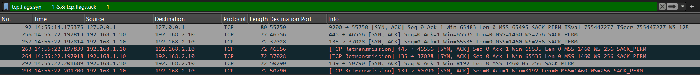
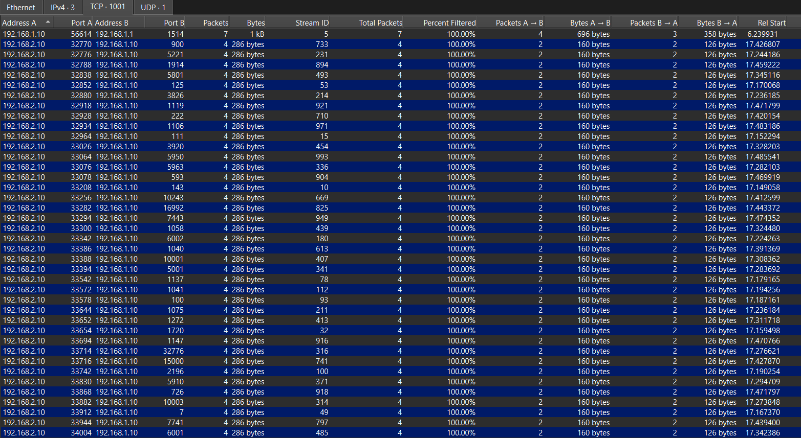

---

### Step 7 — SYN Stealth Scan (Firewall OFF)

```bash
nmap -sS -Pn 192.168.1.10
```

**Result:** Same open ports — 135, 139, 445. Scan completed in ~13 seconds.

**Network Analysis:**
- 4,440 packets captured
- Half-open connection behavior confirmed: SYN → SYN-ACK → RST (no ACK)
- Connection never officially established — stealthier than TCP Connect
- Open ports (135, 139, 445): 6 packets per stream (4 from Kali, 2 from Windows)
- Closed ports: 4 packets per stream (2 from Kali, 2 RST from Windows)
- Win=1024 maintained — consistent scan signature

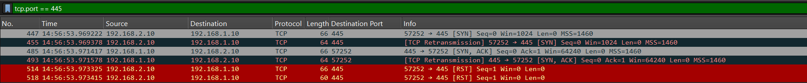
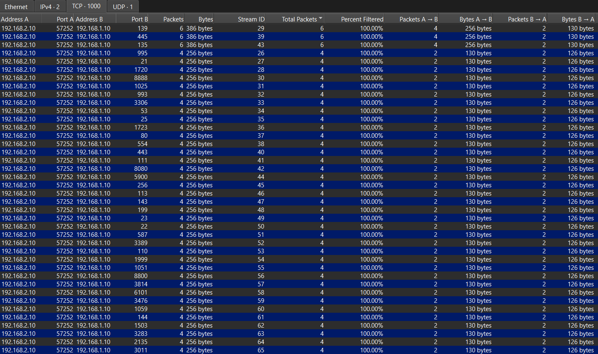

---

### Step 8 — UDP Scan (Firewall OFF)

```bash
nmap -sU -Pn 192.168.1.10
```

**Result:** 8 UDP ports identified. Scan took 1118 seconds — significantly longer than other scans.

**Network Analysis:**
- 19,729 total packets — largest capture of all scans
- 2,038 ICMP responses from Windows vs 4 with firewall ON
- Response pattern: 2 UDP probes → 2 ICMP Port Unreachable responses
- Windows rate-limiting ICMP caused Nmap to increase probe delay from 0ms to 400ms
- Port 137 showed as "open" with firewall ON but "open|filtered" with firewall OFF — firewall response behavior inadvertently aided port state identification
- Counterintuitively slower with firewall OFF due to active ICMP responses triggering rate limiting

| Port | Service | State |
|------|---------|-------|
| 137 | NetBIOS Name Service | Open |
| 138 | NetBIOS Datagram | Open\|Filtered |
| 500 | ISAKMP | Open\|Filtered |
| 1900 | UPnP | Open\|Filtered |
| 4500 | NAT-T-IKE | Open\|Filtered |
| 5050 | MMCC | Open\|Filtered |
| 5353 | Zeroconf/mDNS | Open\|Filtered |
| 5355 | LLMNR | Open\|Filtered |

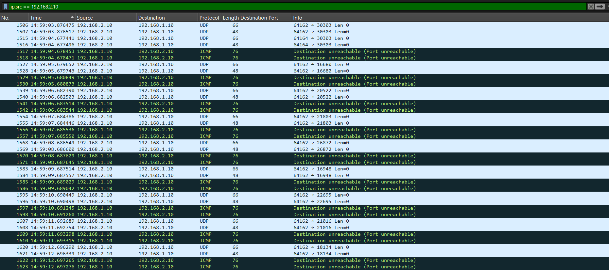

---

### Step 9 — Aggressive Scan (Firewall OFF)

```bash
nmap -A -Pn 192.168.1.10
```

**Result:** Revealed complete system intelligence — hostname, workgroup, MAC address, SMB configuration and security posture.

**Network Analysis:**
- 5,349 total packets — most protocol-diverse capture
- Protocol hierarchy: TCP (98.9%), TLS (2.7%), NBSS (0.8%), SMB2 (0.1%), SMB (0.1%), DCERPC (0.0%)
- 46 application-layer packets responsible for all intelligence extraction
- SMB negotiation confirmed SMBv2/3 active, SMBv1 inactive
- DCERPC bind rejection confirmed port 135 details
- NBSS session carried hostname and workgroup extraction
- SMB2 negotiation revealed signing not required
- 2,240 packets returned from Windows — active service engagement

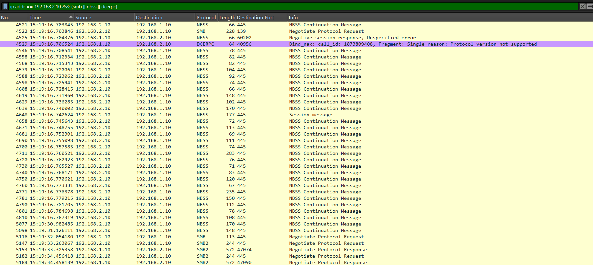
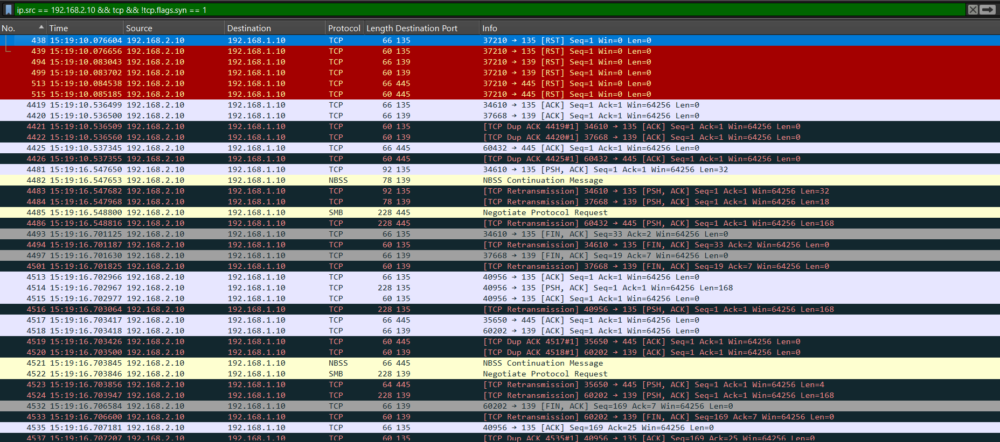
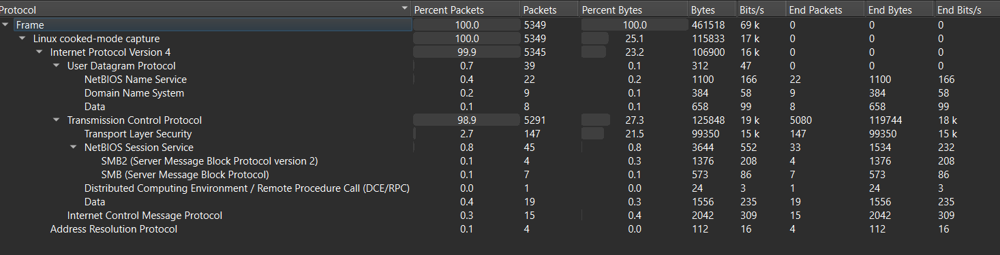

---

## 4. Victim Side Observations (Windows)

### Firewall ON
Windows Defender Firewall silently dropped all incoming packets across all scan types without sending any response. No application-level activity was triggered. From Windows' perspective, the scans were virtually invisible at the OS level.

### Firewall OFF
With firewall disabled, Windows actively responded to all probes:
- Sent SYN-ACK on open ports (135, 139, 445)
- Sent RST on closed TCP ports
- Sent ICMP Port Unreachable on closed UDP ports
- Engaged in full SMB/NBSS negotiation with aggressive scan scripts

### Sysmon Observations
Sysmon remained active throughout logging Event IDs 1 (process creation), 11 (file creation) and 13 (registry modification). No network-related events (Event ID 3) were generated for incoming connections — confirming Sysmon's design limitation for inbound traffic detection.

---

## 5. Network Traffic Analysis Summary

| Scan | Firewall | Packets | Time | Key Finding |
|------|----------|---------|------|-------------|
| TCP (-sT) | ON | 12,105 | ~220s | Silent drop, zero return traffic |
| SYN (-sS) | ON | 9,548 | ~220s | Win=1024 signature, silent drop |
| UDP (-sU) | ON | 7,442 | ~220s | Only 4 ICMP responses, protocol variety |
| Aggressive (-A) | ON | 8,396 | ~220s | OS probes blocked, no intelligence gained |
| TCP (-sT) | OFF | 4,481 | 13s | Full handshake on 135/139/445 |
| SYN (-sS) | OFF | 4,440 | ~13s | Half-open connections, no ACK |
| UDP (-sU) | OFF | 19,729 | 1118s | 2038 ICMP responses, rate limiting |
| Aggressive (-A) | OFF | 5,349 | ~42s | Full intelligence extraction via SMB/NBSS |

---

## 6. SMB Investigation

### SMB Protocol Enumeration

```bash
nmap -Pn -p 445 --script smb-protocols 192.168.1.10
```

**Result:** Despite SMBv1 being enabled as a Windows feature, only SMBv2 and SMBv3 dialects were negotiated:

| Dialect | Version |
|---------|---------|
| 2:0:2 | SMBv2 |
| 2:1:0 | SMBv2.1 |
| 3:0:0 | SMBv3 |
| 3:0:2 | SMBv3.0.2 |
| 3:1:1 | SMBv3.1.1 |

### EternalBlue Vulnerability Check (MS17-010)

```bash
nmap -Pn -p 445 --script smb-vuln-ms17-010 192.168.1.10
```

**Result:** Inconclusive — without active SMBv1 negotiation, EternalBlue has no attack surface. This highlights the importance of protocol-level verification over feature-level checks.

### SMB Security Configuration

**Finding:** Message signing enabled but not required.

**Implication:** SMB traffic is not mandatorily authenticated — target is potentially vulnerable to SMB Relay attacks.

---

## 7. Detection Analysis

### Wazuh SIEM

**Firewall ON:** No scanning-related alerts generated.

**Firewall OFF:** No change in detection. Zero alerts regardless of firewall state.

**Root Cause:** Network-level reconnaissance does not generate endpoint logs that Wazuh captures by default. Wazuh is an endpoint-focused SIEM — it has no visibility into raw network traffic.

### Sysmon

Active throughout simulation logging process and file activity. Incoming network connections from external sources are not captured by design — Sysmon monitors outbound connections initiated by Windows processes only.

### Detection Gap

Both Wazuh and Sysmon failed to detect any scanning activity. Windows Defender Firewall prevented access when enabled but provided no detection or alerting capability. This reveals a fundamental architectural gap — network reconnaissance requires dedicated network-level IDS/IPS tools, not endpoint monitoring solutions.

---

## 8. Critical Findings

| Finding | Severity | Details |
|---------|----------|---------|
| SMB Port 445 Open | High | Exposes file sharing service, historically exploited |
| SMB Signing Not Required | High | Enables SMB Relay attacks without credentials |
| LLMNR Active (UDP 5355) | Medium | Vulnerable to LLMNR poisoning via Responder |
| NetBIOS Active (137/139) | Medium | Leaks hostname, workgroup and system information |
| SMBv1 Enabled | Low | Not actively negotiated but should be disabled |
| No Network IDS | High | Network reconnaissance goes completely undetected |

---

## 9. MITRE ATT&CK Mapping

| Technique | ID | Description |
|-----------|-----|-------------|
| Network Service Discovery | T1046 | Nmap port scanning against target |
| System Network Configuration Discovery | T1016 | Hostname and workgroup enumeration via NBstat |
| SMB/Windows Admin Shares | T1021.002 | SMB exposure on port 445 |
| LLMNR/NBT-NS Poisoning | T1557.001 | LLMNR active and exploitable |

---

## 10. Analysis

### Attack Surface
Through reconnaissance alone, the attacker successfully profiled the target without any authentication or exploitation:

- **Hostname:** WINDOWS10
- **Workgroup:** WORKGROUP
- **MAC Address:** 08:00:27:aa:45:df
- **Open TCP Ports:** 135 (RPC), 139 (NetBIOS), 445 (SMB)
- **Open UDP Ports:** 137, 138, 500, 1900, 4500, 5050, 5353, 5355
- **SMB Version:** SMBv2/3 active, SMBv1 not negotiated
- **SMB Security:** Message signing not required — SMB Relay possible
- **LLMNR Active:** Vulnerable to LLMNR poisoning

### Firewall Impact
Windows Defender Firewall proved highly effective — with firewall ON, all 1000 ports appeared ignored, scans took 17x longer and zero intelligence was gathered. With firewall OFF, the complete attack surface was immediately exposed in seconds.

---

## 11. Mitigation & Recommendations

| Finding | Recommendation | Priority |
|---------|---------------|----------|
| SMB Signing Not Required | Enforce via GPO: `Computer Configuration → Windows Settings → Security Settings → Local Policies → Security Options → "Microsoft network client: Digitally sign communications (always)" → Enabled` | High |
| LLMNR Active | Disable via GPO: `Computer Configuration → Administrative Templates → Network → DNS Client → "Turn off multicast name resolution" → Enabled` | High |
| NetBIOS Active | Disable NetBIOS over TCP/IP on all adapters unless legacy systems require it | Medium |
| SMBv1 Enabled | `Disable-WindowsOptionalFeature -Online -FeatureName SMB1Protocol` | Medium |
| No Network IDS | Deploy Suricata or Snort for real-time network packet inspection and scan detection | High |
| SIEM Detection Gap | Integrate Suricata with Wazuh for centralized network + endpoint alerting | High |

---

## 12. Lessons Learned

**1. Windows Defender Firewall is stronger than expected by default.**
Deeply integrated into Windows and operating at the network layer, it successfully neutralized all reconnaissance attempts without additional configuration — a critical protection layer even for non-technical users.

**2. SIEMs require significant engineering to be effective.**
Wazuh requires significant tuning to balance false positives, noise and true positives. Equally important are false negatives — critical events that go undetected. This balance varies by organization and environment.

**3. Real SOC work requires continuous testing and tuning.**
All potential reconnaissance techniques should be tested against the SIEM, with detection gaps documented and alerts continuously tuned to improve coverage while minimizing noise.

**4. Network architecture matters for monitoring.**
Routing all traffic through a central Ubuntu gateway enabled complete traffic visibility — simulating real SOC network topology where all traffic passes through a monitored chokepoint.

**5. This is just the beginning.**
This simulation motivates further exploration of advanced reconnaissance techniques, higher-level Nmap scripts, and additional real-world attack tools — progressively building complexity in future simulations.

---

*Report generated as part of SOC Home Lab practice*  
*Lab environment: VirtualBox — Segmented Network (Kali: 192.168.2.0/24 | Windows: 192.168.1.0/24 | Ubuntu Gateway: 192.168.1.1/192.168.2.1)*
