# Simulation Report — RDP Brute Force Attack & Detection

**Date:** 2026-05-25 

**Attacker Machine:** Kali Linux (192.168.2.10)

**Victim Machines:** Windows 10 Home (192.168.1.10) — SSH brute force target; Windows 10 Pro (192.168.1.20) — RDP brute force target        

**Objective:** Simulate an attacker's credential-access phase against exposed remote-access services (RDP and SSH), measure the detection capability and thresholds of the Wazuh SIEM against brute force activity at varying speeds, demonstrate a complete compromise chain following a successful credential guess, and assess the protective impact of Network Level Authentication (NLA) and account lockout policy.

**Environment State:** Five scenarios — SSH detection gap (Win10 Home), slow RDP brute force, fast RDP brute force, successful RDP compromise, and NLA-enabled protection assessment (Win10 Pro). Network traffic captured via TCPDump on the Ubuntu gateway and analyzed in Wireshark. Wazuh agents active on both Windows hosts throughout.  

---

## 1. Attack Overview

In this simulation, an attacker positioned on a separate network segment performed credential-access attacks against exposed remote-access services on two Windows 10 endpoints, with all traffic routed through an Ubuntu gateway acting as a central monitoring point. The primary focus was an RDP brute force campaign against a Windows 10 Pro host, executed across four scenarios of increasing consequence: a slow attack designed to stay beneath the SIEM's correlation threshold, a fast attack designed to trigger it, a successful compromise using a weak password to capture the full kill chain, and a final scenario with Network Level Authentication enabled to assess its protective impact. A preliminary SSH brute force against a Windows 10 Home host (Scenario 0) is included because it surfaced a distinct and instructive detection gap that directly informed the RDP investigation. The simulation was designed not only to execute the attacks but to measure exactly what the detection stack saw, what it missed, and why.

---

## 2. Tools Used

| Tool | Purpose |
|------|---------|
| Hydra | Conduct RDP and SSH brute force attacks to simulate an attacker's credential-access phase |
| ncrack | Attempted as an alternative RDP brute force tool when Hydra's RDP module proved unstable |
| rdesktop | Establish an interactive RDP session following successful compromise, and test NLA enforcement against a legitimate RDP client |
| Nmap | Verify RDP service exposure and enumerate RDP encryption/NLA configuration |
| TCPDump | Capture all network traffic on the Ubuntu gateway during each scenario |
| Wireshark | Analyze packet captures and extract network-level evidence |
| Wazuh SIEM | Aggregate endpoint logs and evaluate detection capability against brute force activity |
| Sysmon | Endpoint monitoring on both Windows hosts (SwiftOnSecurity configuration) |

---

## 3. Attack Steps (Attacker Side)

This simulation comprises five scenarios. Scenario 0 is a preliminary SSH brute force against the Windows 10 Home host that surfaced a detection gap; Scenarios 1 through 4 form the core RDP investigation against the Windows 10 Pro host. Each scenario follows the same rhythm: the attack executed from Kali, the resulting endpoint events in Wazuh, and the corresponding network traffic captured at the gateway.

---

### Scenario 0 — SSH Brute Force (Windows 10 Home)

**Setup:** OpenSSH Server enabled on Windows 10 Home (192.168.1.10). Hydra run against the SSH service with a low thread count and a short delay between attempts. The goal was to establish a baseline for how Wazuh correlates failed authentication attempts before moving to RDP.

#### Step 1 — SSH Brute Force Attempt

```bash
hydra -l adamkd -P /usr/share/wordlists/rockyou.txt -t 1 -W 3 ssh://192.168.1.10
```

**Result:** Hydra's SSH module connected to the service but the run terminated early with connection errors. Despite the limited number of attempts that reached the host, individual authentication failures were still logged on the endpoint.

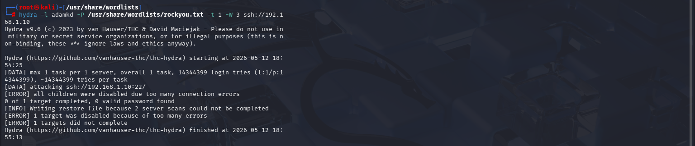

**Finding:** Wazuh logged each failed SSH authentication via rule 60122 (individual logon failure), and these events accumulated rapidly. However, rule 60204 (Multiple Windows Logon Failures), which correlates failures by source IP within a time window, never fired — even though the failures clearly originated from a single source. Inspection of the underlying events revealed the cause: the `data.win.eventdata.ipAddress` field was empty across all OpenSSH-generated failure events on Windows.

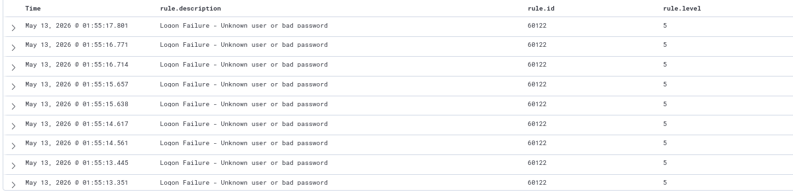

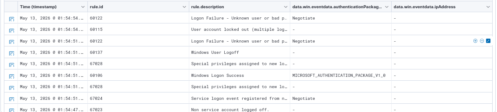

Because rule 60204 correlates on source IP, an empty `ipAddress` field means Wazuh has nothing to group the failures by — each failure is recorded in isolation and the brute force pattern is never assembled. This gap is specific to OpenSSH on Windows, where the failure events do not populate the source-address field that the correlation rule depends on. This finding directly motivated the decision to verify, in the RDP scenarios, whether RDP failure events correctly populate the source IP — which they do.


---

### Scenario 1 — Slow RDP Brute Force (NLA OFF, Strong Password)

**Setup:** Windows 10 Pro (192.168.1.20) with RDP enabled, NLA disabled, and a strong password set on the target account `AdamKD`. Hydra configured for a deliberately slow attack — one thread, 30-second wait between attempts — to test whether a low-and-slow brute force could stay beneath rule 60204's correlation threshold of 8 failures within 240 seconds.

#### Step 1 — Verify RDP Reachability

```bash
nmap -Pn -p 3389 192.168.1.20
```

**Result:** Port 3389 reported `open` (`ms-wbt-server`). Reachability was confirmed across network segments through the Ubuntu gateway, despite ICMP being blocked in both directions by the Windows firewall.

#### Step 2 — Slow Brute Force

```bash
hydra -l AdamKD -P /usr/share/wordlists/rockyou.txt -t 1 -W 30 -V rdp://192.168.1.20
```

**Result:** Hydra ran at approximately 1.4 attempts per minute. Ten attempts were completed between 22:29:45 and 22:36:46 before the RDP module crashed at attempt 11 (`all children were disabled due to too many connection errors`). The strong password was not in range, so no compromise occurred — as intended.

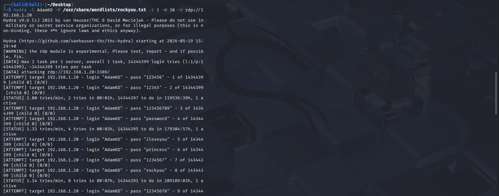

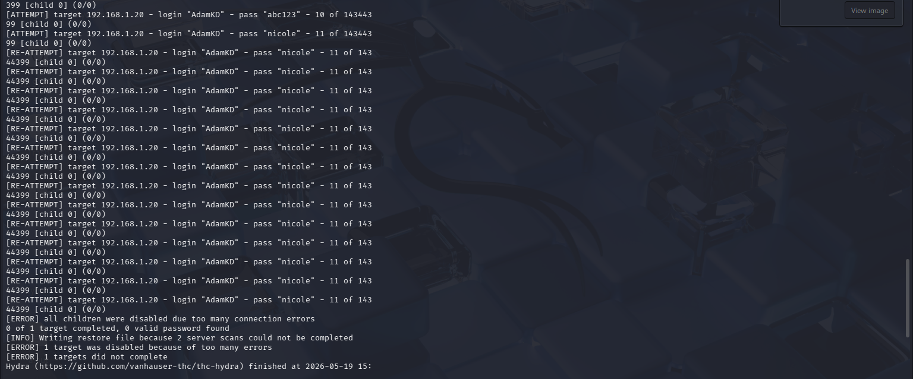

**Detection:** Wazuh logged each of the ten attempts via rule 60122 (level 5), spaced approximately one minute apart. Rule 60204 never fired — the slow pace kept the failure count beneath the 8-in-240-seconds threshold. This is the central finding of Scenario 1: a patient attacker can brute force indefinitely while generating only isolated low-severity alerts that are easily lost in noise.

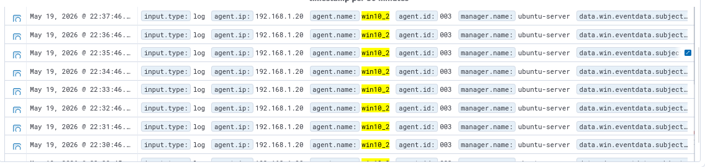

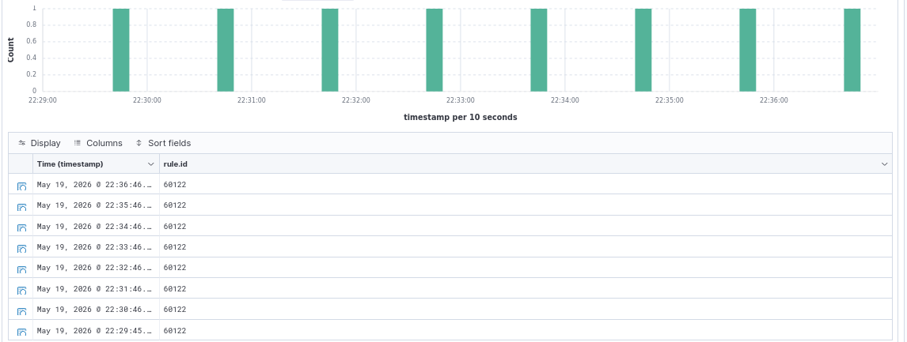

---

### Scenario 2 — Fast RDP Brute Force (NLA OFF, Strong Password)

**Setup:** Identical target configuration to Scenario 1 (NLA off, strong password). Hydra reconfigured for speed — four threads, no wait — to exceed the correlation threshold and trigger rule 60204.

#### Step 1 — Fast Brute Force

```bash
hydra -l AdamKD -P /usr/share/wordlists/rockyou.txt -t 4 -V rdp://192.168.1.20
```

**Result:** Twelve attempts were issued in roughly five seconds before the RDP module crashed under the connection load. The strong password was not found, so again no compromise occurred — the goal here was purely to trigger the correlation rule.

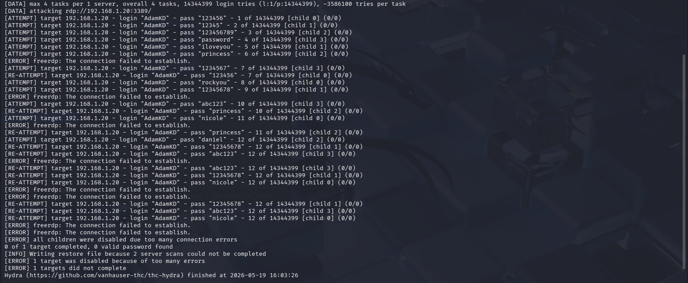

**Detection:** Wazuh logged the individual failures via rule 60122, and rule 60204 (Multiple Windows Logon Failures, level 10) fired at the eighth failure — exactly at the threshold — at approximately 23:03:24. Critically, the attack continued unimpeded after the alert fired; Wazuh detected the brute force but took no action to stop it. The attack only ceased when Windows itself began rate-limiting connections, not because of any defensive response from the SIEM.

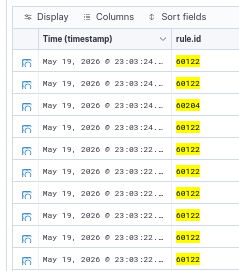

This scenario, read against Scenario 1, demonstrates that rule 60204's effectiveness is entirely dependent on attack speed. The same attack, same tool, same target — only the pacing differs — produces either a high-severity correlated alert or complete correlation silence.

---

### Scenario 3 — Successful Compromise (NLA OFF, Weak Password)

**Setup:** Target account `AdamKD` reconfigured with a weak password (`password123`) present in the rockyou wordlist. The goal was to achieve a successful credential guess and capture the complete compromise chain — from brute force through interactive session.

#### Step 1 — Tooling Difficulties and Tool Substitution

The successful run was not immediate. Hydra's experimental RDP module crashed repeatedly against Windows 10 Pro, consistently failing between attempts 11 and 14 under sustained load, and as early as attempt 3 once Windows had begun rate-limiting from prior runs.

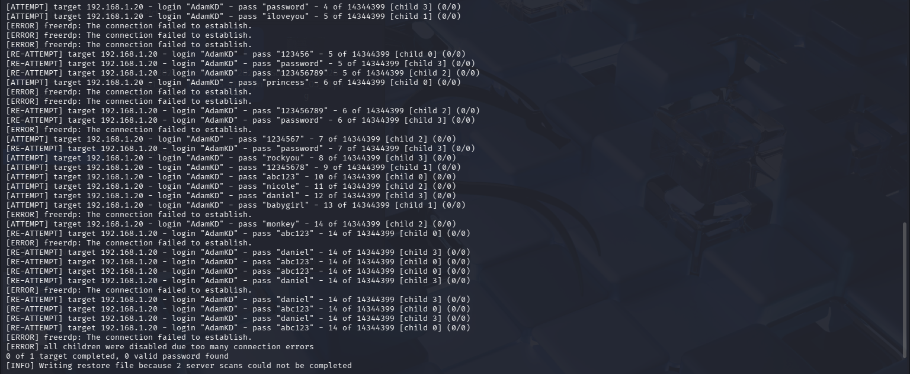

ncrack was attempted as an alternative RDP brute force tool, but it stalled at a rate of 0.00 attempts and never progressed.

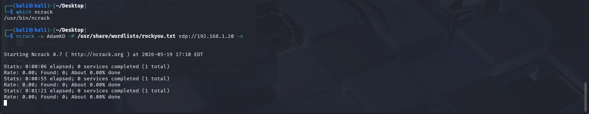

The instability was traced to two factors: the immaturity of Hydra v9.6's RDP module against Windows 10, and Windows' own RDP connection rate-limiting, which became more aggressive the more the host was attacked. The workaround — realistic of an attacker adapting their approach — was to reduce the thread count and add a short inter-attempt delay (`-t 1 -W 5`), and to position the known weak password early in the wordlist so the credential would be found before the module's instability point. This reflects genuine attacker behavior: a targeted wordlist informed by reconnaissance, rather than an exhaustive run.

#### Step 2 — Successful Brute Force

```bash
hydra -l AdamKD -P /usr/share/wordlists/rockyou.txt -t 1 -W 5 -V rdp://192.168.1.20
```

**Result:** The password `password123` was found at attempt 9. The full run took approximately 86 seconds, from 06:31:27 to 06:32:53.

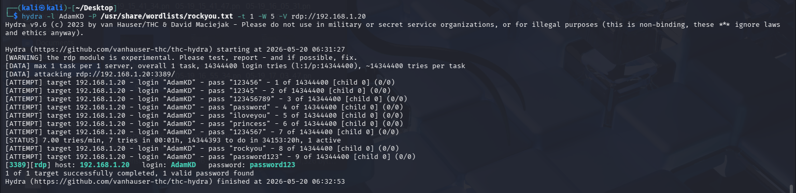

#### Step 3 — Interactive RDP Session

```bash
rdesktop -u AdamKD -p password123 192.168.1.20
```

**Result:** An interactive RDP session was established to the compromised host. To provide unambiguous proof of compromise, the desktop wallpaper was changed to read "YOU HAVE BEEN HACKED."

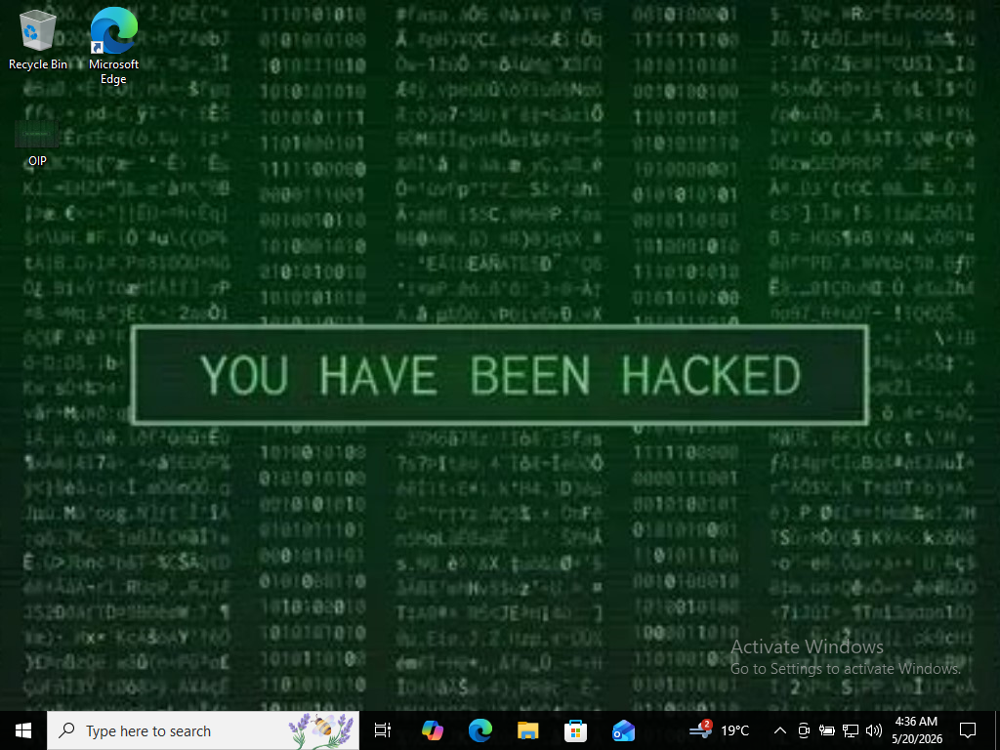

**Detection:** This scenario produced the richest detection picture. Three distinct phases were visible in Wazuh:

First, during the brute force itself, Wazuh's File Integrity Monitoring (FIM) recorded hundreds of registry events — a rapid create/modify/delete cycle on RDP session-state keys, repeating with each connection attempt. This registry churn is a side effect of the RDP service allocating and tearing down session state for every connection, and represents a supplementary brute force signature independent of the authentication-failure events.

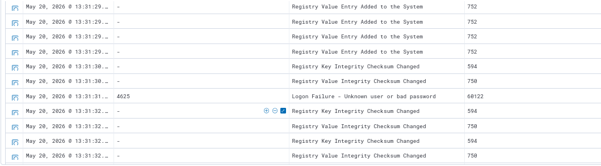

Second, the authentication kill chain assembled in sequence: multiple 60122 failures, rule 60204 firing as the threshold was crossed, then privilege-assignment events (4672) and finally the successful logon (4624).

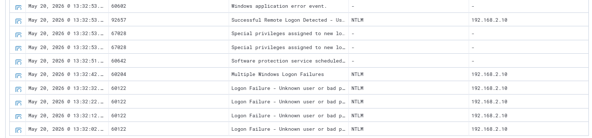

Third, and most significant, the successful logon event (rule 92657) was flagged by Wazuh as a possible pass-the-hash attack. Expanding the event revealed the full context: a network logon (Type 3) using NTLM V2 authentication, originating from workstation `kali` at source address 192.168.2.10, against the `AdamKD` account on `WINDOWS10-PRO`.

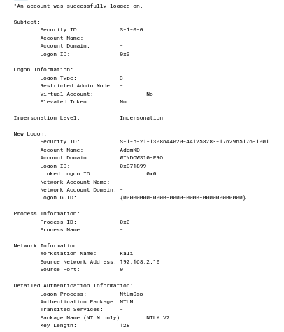

The subsequent interactive session generated its own logon events as the attacker engaged with the desktop.

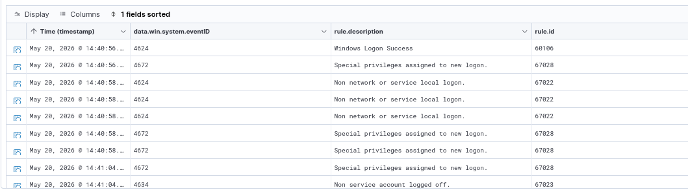

---

### Scenario 4 — NLA Enabled (Protection Impact Assessment)

**Setup:** Network Level Authentication enabled on Windows 10 Pro, strong password restored on `AdamKD`. The original hypothesis was that NLA would block the brute force outright, producing no authentication events. The actual result was more nuanced and more instructive.

#### Step 1 — Confirm NLA Enforcement

```bash
nmap -Pn -p 3389 --script rdp-enum-encryption 192.168.1.20
```

**Result:** The scan confirmed NLA was active and advertised — `CredSSP (NLA): SUCCESS`.

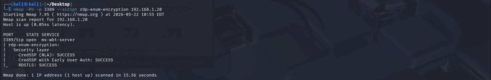

#### Step 2 — Test NLA Against a Legitimate RDP Client

```bash
rdesktop -u AdamKD -p wrongpassword 192.168.1.20
```

**Result:** rdesktop, which properly implements the RDP protocol including CredSSP, was rejected before any session was presented — `Failed to initialize NLA` / `CredSSP required by server`. No login screen appeared; credentials were demanded and rejected at the protocol level. This confirms NLA works as designed against a standard RDP client.

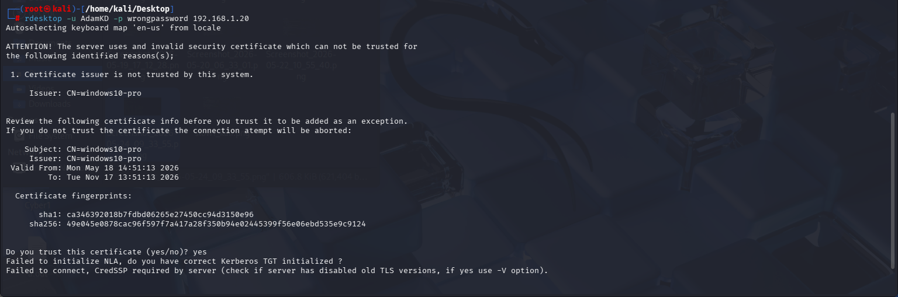

#### Step 3 — Brute Force Against NLA-Enabled Host

```bash
hydra -l AdamKD -P /usr/share/wordlists/rockyou.txt -t 4 -V rdp://192.168.1.20
```

**Result:** Contrary to the initial hypothesis, Hydra was not fully blocked. Its RDP module fell back to NTLM authentication, bypassing the CredSSP/NLA negotiation entirely, and still generated authentication-failure events on the host.

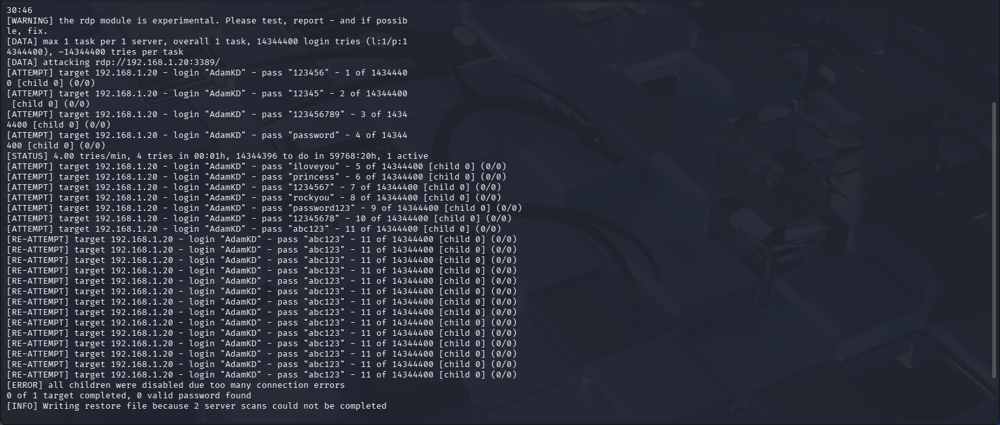

**Detection:** Wazuh logged the failures via rule 60122 and rule 60204 fired as in Scenario 2 — but this time a new event also appeared: rule 60115 (Event ID 4740, User Account Locked Out). The account lockout policy on the host triggered after repeated failures, locking `AdamKD` and ending the attack.

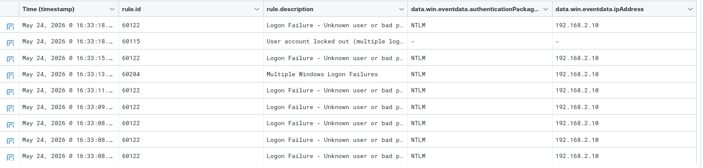

The combined result reveals two distinct threat models. Against a legitimate RDP client, NLA is effective — the connection is refused before authentication. Against a brute force tool capable of NTLM fallback, NLA alone is insufficient; the attack still reaches the authentication layer. In this scenario the actual protective control was not NLA but account lockout policy, which stopped the attack by locking the targeted account.


---

## 4. Victim Side Observations

**Windows 10 Home (Scenario 0):** OpenSSH logged authentication failures to the Windows Security event log, but with an empty source-address field. The host remained otherwise unaffected — no compromise, no service disruption.

**Windows 10 Pro (Scenarios 1–4):** Across the failed brute force scenarios, the host silently processed and rejected each authentication attempt with no user-facing indication. During the successful compromise (Scenario 3), the host accepted the interactive RDP session and the attacker gained full desktop access, evidenced by the modified wallpaper. Under the fast attacks, Windows' own RDP rate-limiting engaged, refusing connections after sustained load — an OS-level protective behavior independent of any configured security control. In Scenario 4, the account lockout policy locked the targeted account after repeated failures.

### Sysmon and FIM Observations

Sysmon remained active on both hosts throughout. The most notable endpoint-telemetry finding was Wazuh's File Integrity Monitoring capturing the registry create/modify/delete churn generated by the RDP service during brute force activity (detailed in Scenario 3) — a high-frequency pattern that does not occur during normal RDP usage.

---

## 5. Network Traffic Analysis

All scenarios were captured at the Ubuntu gateway on the Windows-facing interface (`enp0s8`). The captures reveal clear, measurable differences between attack speeds, between failed and successful authentication, and between brute force traffic and a legitimate interactive session.

| Scenario | Packets | Key Network Characteristic |
|----------|---------|----------------------------|
| 1 — Slow | 827 | Attempts spaced ~60s apart; one short TCP stream per attempt |
| 2 — Fast | 453 | Attempts within milliseconds; RST packets as Windows rate-limits |
| 3 — Brute force | 1,452 | Failed attempts plus one longer, data-heavy successful stream |
| 3 — RDP session | 27,610 | Single sustained stream, 101 MB, highly asymmetric |
| 4 — NLA | 1,026 | Similar to Scenario 1, plus multi-minute TCP keep-alive throttling |

### Scenario 1 — Slow

The capture showed 26 TCP conversations. Each Hydra attempt formed a short, self-contained stream of roughly 19 packets and 5 KB, completing in under 0.15 seconds, with subsequent streams spaced approximately 60 seconds apart — the visible signature of the `-W 30` delay. A single long-duration stream (618 seconds) carried the Wazuh agent's traffic back to the manager.

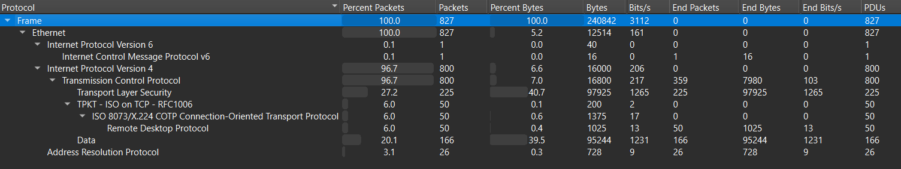

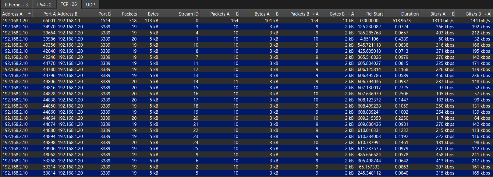

Following an individual attempt confirmed the repeating structure: SYN, RDP negotiation request, TLS handshake, encrypted authentication exchange, encrypted alert (failure), and connection teardown. Notably, the RDP negotiation request carries the username in plaintext (`Cookie: mstshash=AdamKD`) before TLS encryption begins — meaning valid usernames are exposed to passive network observers.

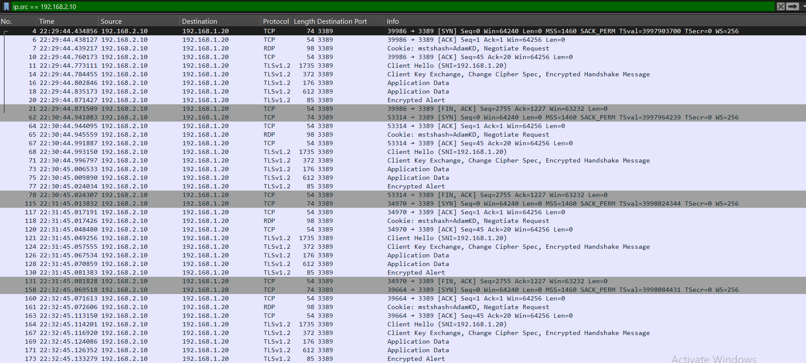

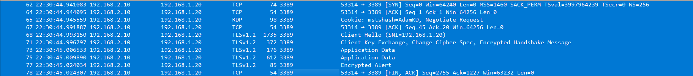

### Scenario 2 — Fast

The fast capture compressed all attempts into roughly five seconds. Multiple SYN packets appeared within milliseconds of one another — the four-thread signature — in stark contrast to Scenario 1's one-per-minute pacing.

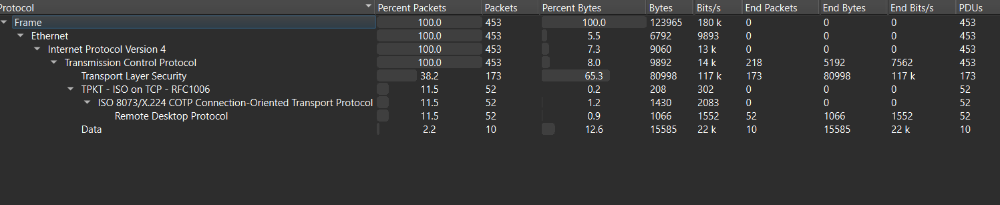

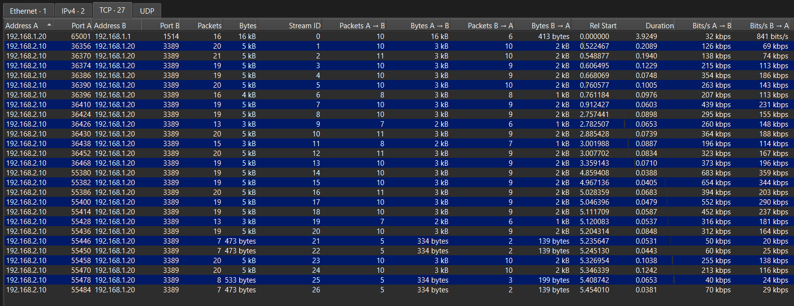

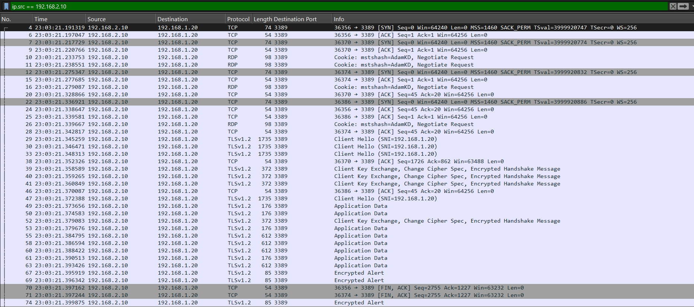

As the attack overwhelmed the service, Windows began issuing RST packets and TCP duplicate ACKs — forcibly resetting connections under load. This is the packet-level manifestation of the RDP rate-limiting that repeatedly crashed Hydra.

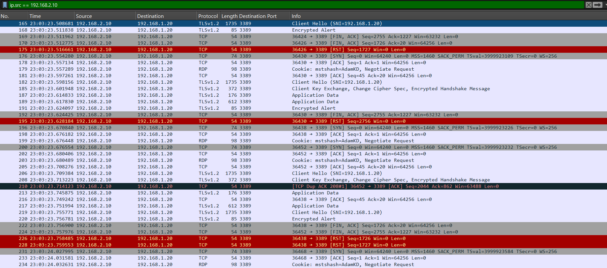

### Scenario 3 — Brute Force and Successful Authentication

The brute force capture (1,452 packets) showed the now-familiar repeating failure pattern, but with one stream standing out: the successful authentication ran longer (1.4 seconds versus ~0.1 for failures) and exchanged substantially more data, reflecting an authentication that proceeded past rejection into a genuine session negotiation before Hydra terminated it.

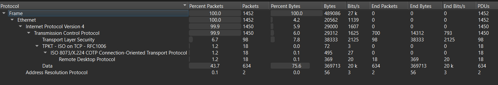

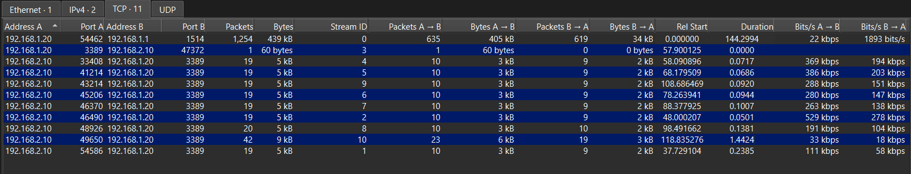

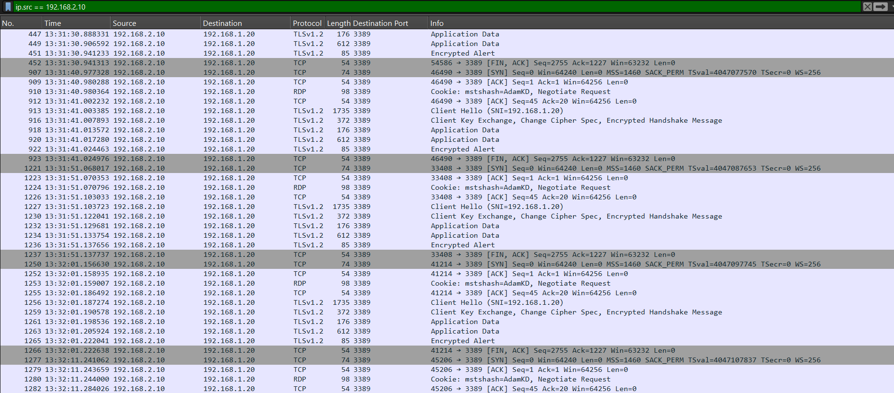

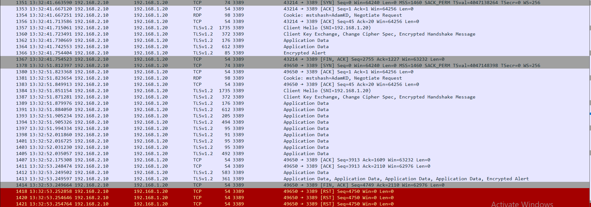

### Scenario 3 — Interactive Session

The interactive session capture is the most dramatic contrast in the simulation: 27,610 packets across only three TCP streams, with the session stream alone carrying 101 MB over 178 seconds. The traffic was highly asymmetric — roughly 2 MB from attacker to host (keyboard and mouse input) against 100 MB from host to attacker (screen rendering). This asymmetric profile — small input, large output, sustained over minutes on port 3389 — is a characteristic signature of an active RDP session and a strong indicator a SOC analyst should flag as a possible live compromise.

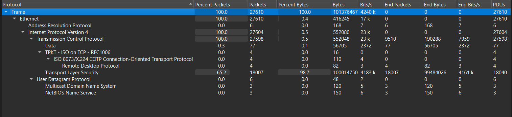

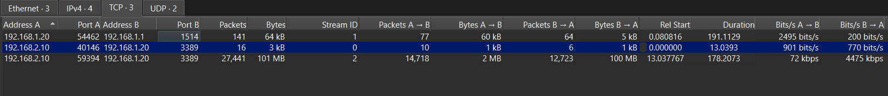

### Scenario 4 — NLA Enabled

At the protocol level, the NLA capture resembled Scenario 1, confirming that the attack traffic still reached the host rather than being blocked outright. One stream was anomalous: a connection that stalled mid-negotiation and was held open for over two minutes by repeated TCP keep-alive probes — the network-level view of Windows throttling the connection rather than dropping it.

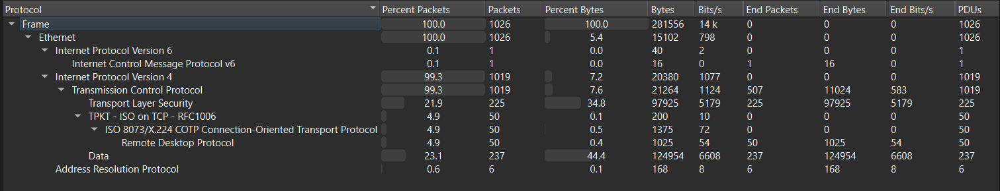

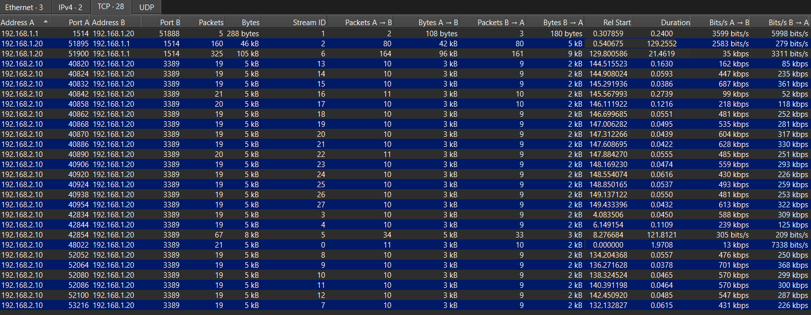

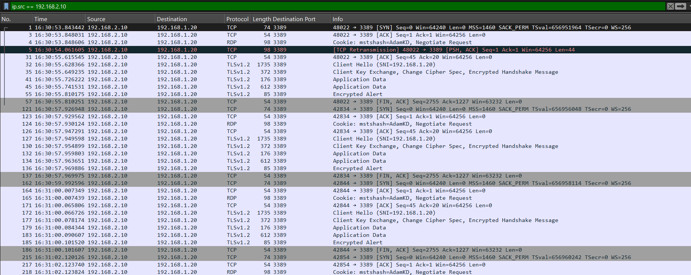

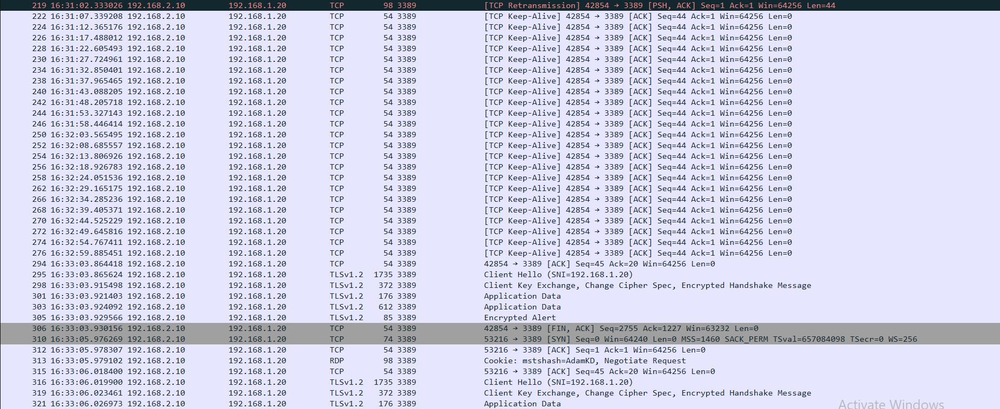

---

## 6. Protocol / Service Investigation

### RDP Negotiation and Username Exposure

Across every RDP scenario, the initial connection begins with an unencrypted RDP negotiation request containing `Cookie: mstshash=AdamKD` before the TLS handshake. The target username is therefore visible to any passive observer on the network path. An attacker performing reconnaissance could harvest valid usernames from RDP traffic without conducting a single authentication attempt.

### NLA / CredSSP Enforcement and NTLM Fallback

Nmap's `rdp-enum-encryption` script confirmed the host advertised CredSSP (NLA), and a legitimate RDP client (rdesktop) was correctly rejected at the protocol layer when NLA was enabled. However, Hydra's RDP module bypassed NLA by negotiating NTLM directly against port 3389 — a fallback path Windows continues to accept for backwards compatibility. The practical consequence is that NLA defends against standard RDP clients but not against tools that speak NTLM directly. The expanded successful-logon event confirmed NTLM V2 as the authentication package used in Scenario 3.

### Windows RDP Rate-Limiting

Windows 10's native RDP service rate-limits aggressively under sustained connection load. This behavior appeared consistently — as RST packets in Scenario 2, as multi-minute TCP keep-alive throttling in Scenario 4, and as the repeated cause of Hydra's RDP module crashes throughout. It is an OS-level mitigation that operates independently of NLA or account lockout, and in practice it significantly slowed every fast attack.

---

## 7. Detection Analysis

### Wazuh — RDP Brute Force

Wazuh's detection of RDP brute force rests on two rules: 60122 (individual failed logon, level 5) and 60204 (multiple logon failures from one source within 240 seconds, level 10). The scenarios demonstrate that 60204's effectiveness is entirely speed-dependent:

- **Scenario 1 (slow):** 60122 fired per attempt; 60204 never fired. Detection gap.
- **Scenario 2 (fast):** 60122 fired per attempt; 60204 fired at the eighth failure. Detected.
- **Scenario 3 (successful):** Full chain — 60122, 60204, successful logon (92657) flagged as possible pass-the-hash.
- **Scenario 4 (NLA):** 60122, 60204, plus account lockout (60115).

Unlike the SSH case, RDP failure events correctly populate the source IP (192.168.2.10), so 60204's correlation works as designed — when the attack is fast enough to cross the threshold.

### Wazuh — Detection Without Prevention

A recurring observation across all scenarios is that Wazuh detects but does not prevent. In Scenario 2, rule 60204 fired at attempt 8 but the attack continued to attempt 12 unimpeded; the SIEM raised an alert but took no action. Stopping the attack required either Windows' own rate-limiting or the account lockout policy. This is the fundamental distinction between detection and response — closing it would require Wazuh active response, an IPS, or a SOAR playbook.

### Wazuh FIM — Supplementary Brute Force Signature

In Scenario 3, Wazuh's File Integrity Monitoring recorded several hundred registry create/modify/delete events during the brute force — a byproduct of the RDP service allocating session state per connection attempt. This high-frequency registry churn is a detection signal independent of authentication-failure events and, with appropriate tuning, could serve as an early indicator of RDP brute force.

### SSH Detection Gap (Scenario 0)

OpenSSH on Windows logs authentication failures with an empty `ipAddress` field. Because rule 60204 correlates on source IP, it can never assemble the brute force pattern for SSH on Windows — the failures are recorded individually but never correlated. This is a genuine, documented blind spot: a brute force that would trigger a high-severity alert over RDP generates only isolated low-severity alerts over SSH on the same monitoring stack.

---

## 8. Critical Findings

| Finding | Severity | Details |
|---------|----------|---------|
| Slow brute force evades correlation | High | At ~1.4 attempts/min, rule 60204 never fires; attacker generates only isolated level-5 alerts |
| SIEM detects but does not prevent | High | Rule 60204 fired mid-attack but the brute force continued; no automated response exists |
| SSH on Windows — empty source IP | High | Empty `ipAddress` field prevents 60204 correlation entirely for SSH brute force |
| NLA bypassed via NTLM fallback | High | Hydra reaches the authentication layer despite NLA by negotiating NTLM directly |
| Successful compromise via weak password | Critical | `password123` recovered in ~86 seconds, leading to full interactive RDP access |
| Username exposed in plaintext | Medium | RDP negotiation reveals `mstshash=<username>` before TLS, enabling passive username harvesting |
| Asymmetric session traffic unmonitored | Medium | 100 MB host-to-attacker RDP traffic went undetected at the network layer (no IDS/IPS) |

---

## 9. MITRE ATT&CK Mapping

| Technique | ID | Description |
|-----------|-----|-------------|
| Brute Force: Password Guessing | T1110.001 | Hydra password guessing against RDP and SSH services |
| Valid Accounts | T1078 | Successful authentication with recovered credentials in Scenario 3 |
| Remote Services: Remote Desktop Protocol | T1021.001 | Interactive RDP session established post-compromise |
| External Remote Services | T1133 | RDP and SSH exposed as externally reachable entry points |
| Account Discovery | T1087 | Username exposure via plaintext RDP negotiation cookie |

---

## 10. Analysis

The four RDP scenarios, read together, expose a defensive posture that is far more conditional than a checkbox view of security controls would suggest. Each control — SIEM correlation, NLA, account lockout — protects against a specific threat model and fails silently against others.

The most important finding is the speed-dependence of detection. An attacker who simply slows down to roughly one attempt per minute renders rule 60204 inert while still making steady progress toward a weak password. The detection that looks robust in Scenario 2 is absent in Scenario 1 for no reason other than pacing. A defender relying on 60204 as their brute force tripwire is protected only against attackers in a hurry.

The second finding is the gap between detection and prevention. Even when 60204 fired, nothing stopped the attack. In a real SOC this is the difference between an alert in a queue and an automated block; the dwell time between detection and human or automated response is exactly the window an attacker exploits. Here, the attack was halted by Windows' rate-limiting and by account lockout — neither of which is part of the SIEM.

The third finding concerns NLA. It is frequently treated as a definitive brute force mitigation, but this simulation shows it secures only the front door: it stops legitimate RDP clients without valid credentials, yet a tool willing to negotiate NTLM directly walks past it to the authentication layer. The control that actually stopped the NLA-enabled attack was account lockout — a reminder that layered controls matter precisely because no single one is comprehensive.

Finally, the successful compromise demonstrates how quickly a weak password collapses the entire defensive stack. Once `password123` was recovered, every subsequent control was moot; the attacker held an interactive session with full desktop access in under two minutes of effective attack time. The 100 MB of screen-rendering traffic that followed flowed entirely undetected at the network layer, underscoring the absence of any network-level intrusion detection.

---

## 11. Mitigation & Recommendations

| Finding | Recommendation | Priority |
|---------|---------------|----------|
| Slow brute force evades 60204 | Add a longer-window correlation rule (e.g. N failures over hours, not seconds) to catch low-and-slow attacks; alert on cumulative failures per account/source | High |
| SIEM detects but does not prevent | Deploy Wazuh active response to auto-block source IPs via the gateway firewall after threshold breach; or integrate an IPS | High |
| Weak password compromise | Enforce strong password policy via GPO (length, complexity); the single most effective control demonstrated | Critical |
| NLA bypassed via NTLM | Restrict or disable NTLM authentication for RDP where feasible; prefer Kerberos; restrict port 3389 to trusted source IPs at the firewall | High |
| Account lockout effectiveness | Confirmed effective in Scenario 4; formalize lockout policy via GPO (threshold, duration) across all hosts | High |
| No network-level detection | Deploy Suricata or Snort at the gateway to detect brute force patterns and anomalous RDP session traffic; integrate with Wazuh | High |
| Username exposure | Where possible, place RDP behind a VPN or RD Gateway so the negotiation is not exposed on the open network path | Medium |
| SSH source-IP gap on Windows | Add a custom Wazuh decoder/rule for OpenSSH-on-Windows failures, or correlate on an alternative field, to restore brute force correlation for SSH | Medium |

---

## 12. Lessons Learned

**1. Detection is conditional, not binary.** The same rule that reliably caught a fast brute force was completely blind to a slow one. Security controls protect against specific threat models, and a control's presence does not guarantee coverage — its thresholds and assumptions have to be tested against realistic attacker variation.

**2. Detection is not prevention.** A SIEM tells you something is happening; it does not stop it. The gap between an alert firing and an attack being stopped is real and exploitable, and closing it requires deliberate response capability — not just more detection rules.

**3. NLA is a partial control.** Enabling NLA is worthwhile but not sufficient against tools that bypass it via NTLM fallback. Understanding precisely what a control does and does not cover is more valuable than assuming it is comprehensive.

**4. Tooling reality matters.** Hydra's RDP module is unstable against Windows 10, and ncrack fared no better. Documenting the tooling difficulties honestly — and adapting around them as a real attacker would — is part of the work, not a failure of it.

**5. The network layer tells a story the endpoint cannot.** The asymmetric traffic profile of an active RDP session, the RST storms of rate-limiting, and the keep-alive throttling under NLA were all visible only at the gateway. Endpoint logs and network captures are complementary, and a complete picture requires both.

**6. A weak password defeats everything.** Every sophisticated control in this simulation was rendered irrelevant the moment a guessable password was in play. Password hygiene remains the foundation that the rest of the stack is built on.

---

*Report generated as part of SOC Home Lab practice*
*Lab environment: see [Lab Setup Documentation](../../setup/lab-setup.md)*
